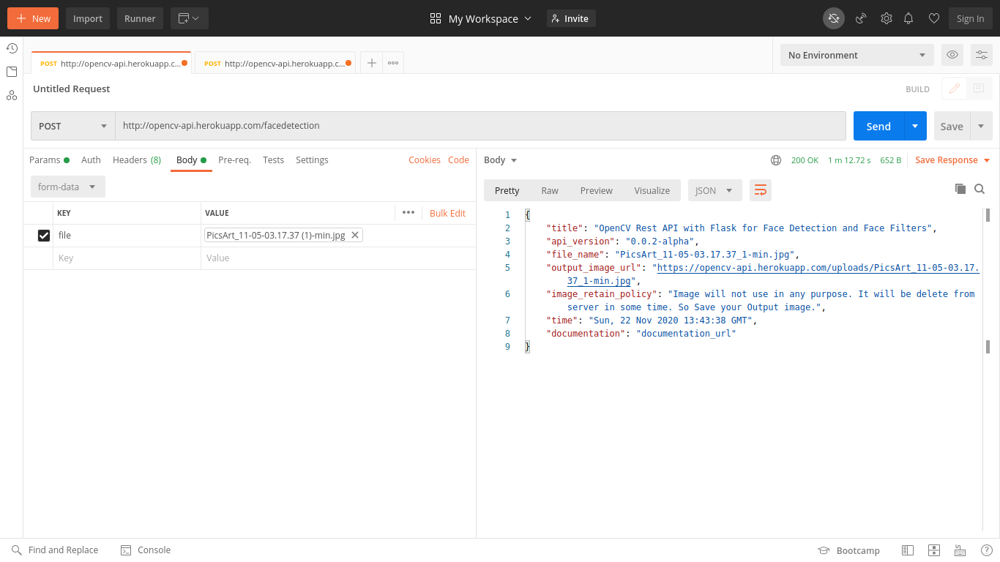

  
  <h2 align="center">👉 Opencv Face Filter API is for face-detection and snapchat like filters.👈</h2>

## Introduction

It's a Rest API for face-filter & face-detection using OpenCV, flask.
Currently, It's using simple haar cascade and deep neural network for face detection and applying mask by resizing on the face.
It can be integrated into the web app or Android/IOS mobile APP.

API_URL:- <https://opencv-api.herokuapp.com/>

## How to Use

Currently it's has two endpoints. 
- face detection
- face filter

Below is the postman screenshot for API use case.

## Documentation

OpecvAPI documentation:- <https://opencv-api.readthedocs.io/>

### Face-Filter

Face Filter is a simple api for applying snapchat like filters on face.

Face-Filter URL:- <https://opencv-api.herokuapp.com/facefilter>

### Face-Detection

Face detection api is a simple api for face detection.
Face-Detection URL:- <https://opencv-api.herokuapp.com/facedetection>

## Report a Bug

Report a bug here: codeperfectplus@gmail.com

## Suggestions

email your suggestions here: codeperfectplus@gmail.com

## Project RoadMap

- Improve accuracy for face detection.
- Improve accuracy for face mask
- adding more mask
- api version 2 for more complex filters.
- color effect api for image.

## Author

Author : CodePerfectPlus
Language : Python
Github : https://github.com/codePerfectPlus
Website : http://codeperfectplus.github.io/